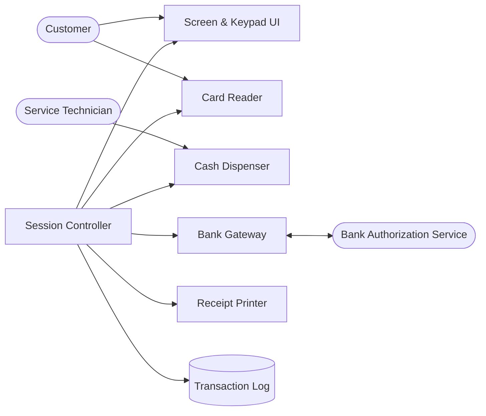
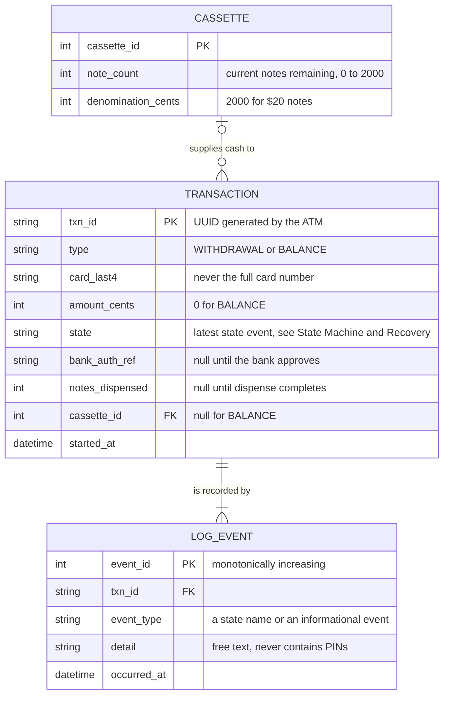
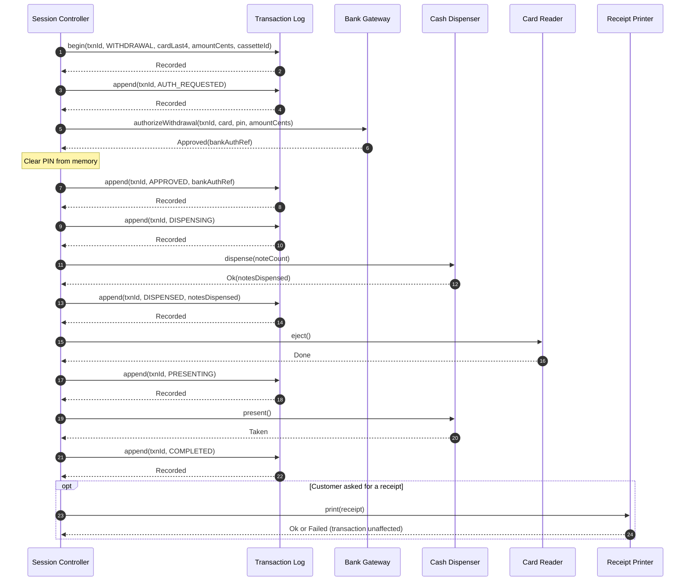
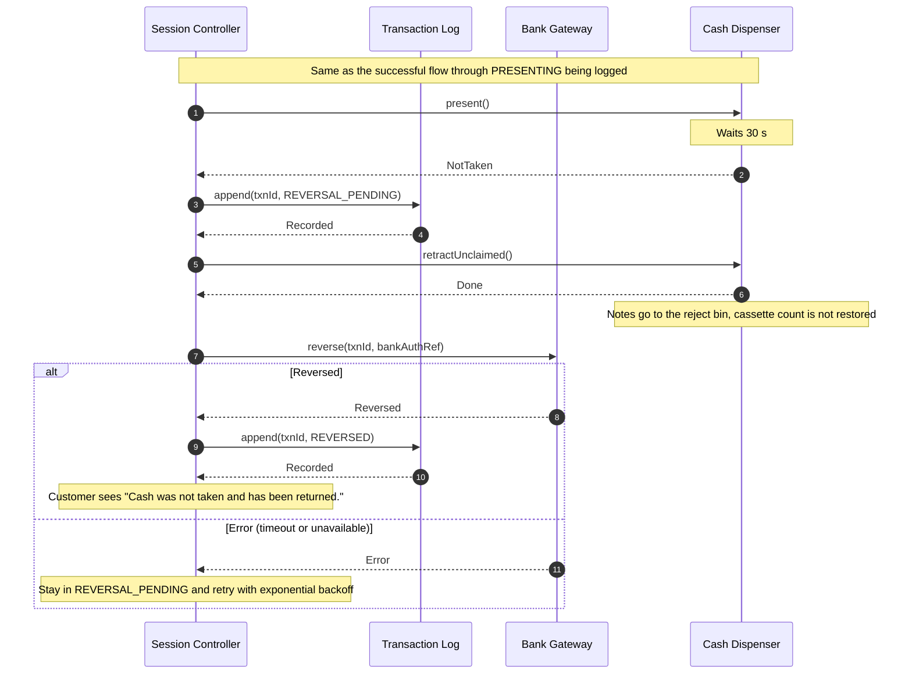

<!-- ExampleBank ATM Design Doc -->

<!-- This should be available to students on GitHub so that the Mermaid
renders correctly. -->

_Each section of this document is incomplete and is shown for example
purposes only._

## Overview

The ATM lets a bank customer insert a debit card, authenticate with a PIN,
and withdraw cash or check an account balance at a standalone kiosk.

## Actors

* **Customer**: Inserts card, enters PIN, selects transactions, takes
  cash and receipt.
* **Bank Authorization Service** (external): Verifies PINs, approves or
  declines transactions, and holds account balances.
* **Service Technician**: Loads cash cassettes, empties the reject bin,
  and clears hardware faults.

## Goals/Non-Goals

### Goals

* Withdraw cash in $20 increments.
* Display account balance.
* Print an optional receipt.

### Non-Goals

* Deposits (cash or check).
* Transfers between accounts.
* Contactless or mobile-wallet cards.
* PIN changes.
* Remote monitoring, and technician authentication.

## Constraints

* All balances and approvals come from the Bank Authorization Service;
  the ATM keeps no account state.
* The cash dispenser holds a maximum of 2,000 notes per cassette and
  dispenses at most 40 notes per transaction.
* PINs must never be written to disk or logs (card-network security
  rules).
* The card reader supports chip and magnetic stripe only.

## Assumptions

* The network link to the bank is available at least 99% of the time.
* The cassette contains only $20 notes.
* An idle customer has abandoned the session. (The idle limit is in
  Non-Functional Requirements.)
* Only USD is supported.
* The bank treats a repeated request with the same `txnId` as the same
  request, and it offers a `getStatus` query for any `txnId`.
* The cash dispenser can report whether notes are sitting in the
  presenter, including after a power loss and restart.

## Non-Functional Requirements

| Requirement | Measure |
|---|---|
| Authorization latency | 95% of bank round trips complete in under 1.5 s |
| Dispense time | Cash presented within 10 s of bank approval |
| Idle timeout | Session ends and card is ejected after 30 s of inactivity |
| Crash recovery | While the bank is reachable, 100% of unfinished transactions are resolved within 5 min of restart |
| Security | 0 occurrences of a PIN in any log or persisted storage |

## Component Diagram and Description

Arrows from the Session Controller mean "calls". Arrows from people mean
physical interaction.

| Component | Responsibility |
|---|---|
| **Screen & Keypad UI** | Shows prompts and collects PIN, menu selections, amounts, and the receipt choice. |
| **Card Reader** | Reads card data; ejects or retains the card on command. |
| **Session Controller** | Owns the transaction state machine (see State Machine and Recovery) and runs recovery on restart. The only component that coordinates the others. |
| **Bank Gateway** | Translates internal requests to the bank's protocol, with timeout handling. |
| **Cash Dispenser** | Dispenses and presents notes, retracts unclaimed notes, and reports the cassette count and presenter contents. |
| **Receipt Printer** | Prints a receipt from transaction data. |
| **Transaction Log** | Append-only record of every transaction, used for crash recovery. Never contains PINs. |

------------

## Data Model

The ATM stores no account data (see Constraints). It persists only what it
needs to reconcile with the bank after a failure and to track physical cash.
Session state (current screen, entered PIN digits) lives in memory only and
is never persisted.

**Event types.** Every `LOG_EVENT.event_type` is either a *state event* (one
of the state names in State Machine and Recovery) or an *informational event*.
The informational events are `PRINT_FAILED` and `NOTES_RETRACTED`.
Informational events never change a transaction's state.

**Storage rules**

* `LOG_EVENT` is append-only. Rows are never updated or deleted.
* `TRANSACTION.state` is the latest state event for that transaction. It is
  stored for fast lookup, and the log is the source of truth.
* `type`, `card_last4`, `amount_cents`, `cassette_id`, and `started_at` are set
  once, when the transaction is created. `bank_auth_ref` and `notes_dispensed`
  are set when the `APPROVED` and `DISPENSED` events are recorded, and never
  change after that.
* `CASSETTE.note_count` is updated only by the Cash Dispenser: after a
  successful dispense, or when a technician loads the cassette.
* The full card number, PIN, and card verification data are never stored.

## State Machine and Recovery

Every transaction is in exactly one state. The **terminal** states are
`DECLINED`, `COMPLETED`, `REVERSED`, and `CANCELLED`. A transaction may
change state only along the transitions in this table. On restart, every
transaction that is not in a terminal state is recovered using the last
column.

| State | Meaning | Allowed next states | On restart, if this is the last state |
|---|---|---|---|
| `STARTED` | Transaction created. The bank has not been asked. | `AUTH_REQUESTED`, `CANCELLED` | Log `CANCELLED`. |
| `AUTH_REQUESTED` | The bank is about to be asked, or has been asked, and the result is not yet recorded. | `APPROVED` (withdrawal approved), `COMPLETED` (balance shown), `DECLINED` (bank declined, or bank has no record of the request), `REVERSAL_PENDING` (bank approved, but the withdrawal will not proceed), `REVERSED` (bank reports it already reversed), `CANCELLED` (balance only, during recovery) | **BALANCE:** log `CANCELLED` (no money moves). **WITHDRAWAL:** call `getStatus`. *Approved* → log `REVERSAL_PENDING` with the `bankAuthRef`, then continue as that row. *Declined* or *NotFound* → log `DECLINED`. *Reversed* → log `REVERSED`. *Error* → retry with exponential backoff and leave the state unchanged. No cash can have been dispensed yet. |
| `APPROVED` | Bank approved. No cash staged. | `DISPENSING`, `REVERSAL_PENDING` | Log `REVERSAL_PENDING`, then continue as that row. |
| `DISPENSING` | About to dispense, or dispensing. Notes may be staged but have not been presented. | `DISPENSED`, `REVERSAL_PENDING` | Log `REVERSAL_PENDING`, then continue as that row. |
| `DISPENSED` | Notes are staged. The card is being ejected or retained. | `PRESENTING`, `REVERSAL_PENDING` | Log `REVERSAL_PENDING`, then continue as that row. |
| `PRESENTING` | Shutter is about to open or is open. The ATM cannot know whether the customer took the cash. | `COMPLETED` (taken), `REVERSAL_PENDING` (not taken) | Call `getPresenterStatus` (read-only). *Empty* → the customer took the cash, so log `COMPLETED`. *NotesPresent* → log `REVERSAL_PENDING`, then continue as that row. |
| `REVERSAL_PENDING` | The bank must end up holding no charge for this `txnId`. | `REVERSED` | Call `retractUnclaimed` (safe to repeat), then call `reverse` until the bank returns *Reversed*, using exponential backoff. Then log `REVERSED`. |
| `DECLINED`, `COMPLETED`, `REVERSED`, `CANCELLED` | Terminal. | None | Nothing to do. |

## Invariants

Each invariant must hold at all times and must be testable.

1. The ATM never dispenses cash for a transaction unless the Bank
   Authorization Service has approved that exact `txn_id` and amount.
2. The dispensed amount always equals the approved amount, or the
   transaction is reversed with the bank.
3. A withdrawal amount is always a multiple of $20 and never exceeds the
   per-transaction note limit in Constraints.
4. At most one session is active at a time.
5. A PIN exists only in memory, from keypad entry until the last bank
   call that uses it returns (including its one retry), and is cleared
   immediately after. A PIN is never reused for a new transaction.
6. No PIN or full card number appears in any log, file, or persisted
   storage.
7. Every transaction ends in a terminal state. A transaction that has
   not reached one is retried until it does, including across restarts.
8. A transaction's state changes only along the transitions in State
   Machine and Recovery.
9. The card is ejected or retained before cash is presented to the
   customer.
10. `CASSETTE.note_count` never goes below 0 and never exceeds 2,000.
11. `LOG_EVENT.event_id` values strictly increase, with no gaps.
12. While the ATM is out of service, no new session starts, and recovery
    and reversals continue to be retried.

## Interfaces

An interface describes how the Session Controller asks a component to do
something. Each method gets one table with the same rows:

| Row | Meaning |
|---|---|
| **Purpose** | What the method is for, in one sentence. |
| **Inputs** | What the caller provides. |
| **Requires** | What must be true before the call. Breaking this is the caller's bug. |
| **Outcomes** | Every result the caller must handle. A failure is an outcome, not a crash. |
| **Guarantees** | What is true after the call, whatever the outcome. |
| **Timing** | Time limits and whether repeating the call is safe. |

Conventions:

* Only the Session Controller calls other components. Components never
  call each other.
* Every call may take time. The caller waits for the result.
* A method fails outright only if the component itself is lost (for
  example, a dead driver). The Session Controller treats that as Failure
  Mode 15.
* Shared values (`pin`, `card`, and so on) are defined in **Shared
  Values** at the end of this section.

### Screen & Keypad UI

#### showScreen

| | |
|---|---|
| **Purpose** | Display a screen to the customer. |
| **Inputs** | `screen`; optional `params`, text to fill into the screen |
| **Requires** | `params` supplies every placeholder the screen uses |
| **Outcomes** | Done |
| **Guarantees** | The screen is visible before the call returns |
| **Timing** | Immediate |

#### awaitInput

| | |
|---|---|
| **Purpose** | Wait for the customer to do one thing at the keypad or screen. |
| **Inputs** | `prompt` (what to ask for); `timeoutMs` |
| **Requires** | A screen asking for this input is showing |
| **Outcomes** | **Pin** (`digits`) **MenuChoice** (`choice`) **Amount** (`dollars`, whole number) **ReceiptChoice** (`wanted`, yes or no) **Cancel** **Timeout** |
| **Guarantees** | Exactly one outcome is returned. PIN digits are masked on screen and appear only in this return value, never in a log. |
| **Timing** | Returns **Timeout** once `timeoutMs` passes with no input |

### Card Reader

#### awaitCard

| | |
|---|---|
| **Purpose** | Wait for a card to be inserted and read. |
| **Inputs** | None |
| **Requires** | No card is in the reader |
| **Outcomes** | **Card** (`card`) **Unreadable**: card is still in the reader, caller must `eject` **Unsupported**: same as Unreadable **Jam**: caller takes the ATM out of service |
| **Guarantees** | Returns only after the card is fully inserted and read |
| **Timing** | Waits indefinitely |

#### eject

| | |
|---|---|
| **Purpose** | Give the card back to the customer. |
| **Inputs** | None |
| **Requires** | A card is in the reader |
| **Outcomes** | Done |
| **Guarantees** | The card is released before the call returns |
| **Timing** | Immediate |

#### retain

| | |
|---|---|
| **Purpose** | Keep the card inside the machine (for example, after 3 bad PINs, or after a restart). |
| **Inputs** | None |
| **Requires** | A card is in the reader |
| **Outcomes** | Done |
| **Guarantees** | The card stays inside until a technician clears it |
| **Timing** | Immediate |

### Bank Gateway

#### authorizeWithdrawal

| | |
|---|---|
| **Purpose** | Ask the bank to approve a withdrawal. |
| **Inputs** | `txnId`, `card`, `pin`, `amountCents` |
| **Requires** | `AUTH_REQUESTED` is already logged for `txnId`. `amountCents` is a multiple of 2000 and within the per-transaction limit (see Constraints). |
| **Outcomes** | **Approved** (`bankAuthRef`) **Declined** (reason: bad PIN, insufficient funds, card blocked, limit exceeded) **Error** (reason: timeout, unavailable) |
| **Guarantees** | The gateway keeps no copy of `pin` after returning. The caller clears its own copy as described in Invariant 5. |
| **Timing** | 3 s per attempt. Safe to repeat with the same `txnId`; the bank returns the same result. After an **Error**, retry once with the same `txnId` and the same `pin`. If the retry also returns **Error**, see Failure Mode 4. A new PIN attempt needs a new `txnId`. |

#### queryBalance

| | |
|---|---|
| **Purpose** | Ask the bank for the account balance. |
| **Inputs** | `txnId`, `card`, `pin` |
| **Requires** | `AUTH_REQUESTED` is already logged for `txnId` |
| **Outcomes** | **Balance** (`balanceCents`) **Declined** (reason, as above) **Error** (reason, as above) |
| **Guarantees** | No money moves. The gateway keeps no copy of `pin`. |
| **Timing** | 3 s per attempt. Safe to repeat with the same `txnId`. |

#### reverse

| | |
|---|---|
| **Purpose** | Undo an approved withdrawal that was not delivered. |
| **Inputs** | `txnId`, `bankAuthRef` |
| **Requires** | The bank previously approved this `txnId`. `REVERSAL_PENDING` is logged, unless the log is down (Failure Mode 14). |
| **Outcomes** | **Reversed** **Error** (reason: timeout, unavailable): the transaction stays `REVERSAL_PENDING` and the caller retries with exponential backoff |
| **Guarantees** | After **Reversed**, the customer's account is not charged for this `txnId` |
| **Timing** | 3 s per attempt. Safe to repeat; reversing an already reversed `txnId` returns **Reversed**. |

#### getStatus

| | |
|---|---|
| **Purpose** | Ask the bank what happened to a transaction (used in recovery and when a response is lost). |
| **Inputs** | `txnId` |
| **Requires** | None |
| **Outcomes** | **NotFound**: the bank never got the request, so there is nothing to reverse **Approved** (`bankAuthRef`) **Declined** **Reversed** **Error** (reason: timeout, unavailable) |
| **Guarantees** | Changes nothing at the bank |
| **Timing** | 3 s per attempt. Safe to repeat. |

### Cash Dispenser

#### getNoteCount

| | |
|---|---|
| **Purpose** | Report how many notes are in the cassette. |
| **Inputs** | None |
| **Requires** | None |
| **Outcomes** | **Count** (whole number, 0 to 2000) |
| **Guarantees** | Reflects every completed dispense |
| **Timing** | Immediate. Safe to repeat. |

#### dispense

| | |
|---|---|
| **Purpose** | Count out notes and stage them behind the shutter. |
| **Inputs** | `noteCount` |
| **Requires** | `noteCount` is at least 1, within the per-transaction limit (see Constraints), and no more than `getNoteCount()`. `DISPENSING` is logged. |
| **Outcomes** | **Ok** (`notesDispensed`) **Partial** (`notesDispensed`): jam mid-dispense; caller logs `REVERSAL_PENDING`, calls `retractUnclaimed`, reverses, then takes the ATM out of service **Failed**: nothing staged; caller logs `REVERSAL_PENDING`, reverses, then takes the ATM out of service |
| **Guarantees** | Staged notes cannot be reached by the customer. The cassette count drops by `notesDispensed` on **Ok** or **Partial** only. |
| **Timing** | Not safe to repeat. A second call dispenses more cash. |

#### present

| | |
|---|---|
| **Purpose** | Open the shutter so the customer can take the cash. |
| **Inputs** | None |
| **Requires** | The last `dispense` returned **Ok**. The card has already been ejected or retained. `PRESENTING` is logged. |
| **Outcomes** | **Taken** **NotTaken**: caller logs `REVERSAL_PENDING`, calls `retractUnclaimed`, then reverses |
| **Guarantees** | The customer can reach the cash until the call returns |
| **Timing** | Waits 30 s, then returns **NotTaken** |

#### getPresenterStatus

| | |
|---|---|
| **Purpose** | Report whether notes are sitting in the presenter (staged or presented, not taken). Used in recovery. |
| **Inputs** | None |
| **Requires** | None |
| **Outcomes** | **NotesPresent** (`count`) **Empty** |
| **Guarantees** | Changes nothing. Remains accurate after a restart. |
| **Timing** | Immediate. Safe to repeat. |

#### retractUnclaimed

| | |
|---|---|
| **Purpose** | Pull staged or presented notes back in and close the shutter. |
| **Inputs** | None |
| **Requires** | `REVERSAL_PENDING` is logged |
| **Outcomes** | Done |
| **Guarantees** | The shutter is closed. Any retracted notes go to the reject bin and are **not** added back to the cassette count. If notes were retracted, a `NOTES_RETRACTED` event is logged afterward. |
| **Timing** | Safe to repeat |

#### loadCassette

| | |
|---|---|
| **Purpose** | Record that a technician loaded the cassette. |
| **Inputs** | `noteCount` |
| **Requires** | The ATM is out of service. `noteCount` is 0 to 2000. |
| **Outcomes** | Done |
| **Guarantees** | The cassette count equals `noteCount` |
| **Timing** | Safe to repeat |

### Receipt Printer

#### print

| | |
|---|---|
| **Purpose** | Print a receipt. |
| **Inputs** | `receipt` |
| **Requires** | `receipt` has no PIN and no full card number |
| **Outcomes** | **Ok** **Failed** (reason: out of paper, jam): caller logs `PRINT_FAILED` and continues; the transaction is unaffected |
| **Guarantees** | None beyond the outcome |
| **Timing** | 10 s |

### Transaction Log

#### begin

| | |
|---|---|
| **Purpose** | Create a transaction and record its first event. |
| **Inputs** | `txnId`, `type`, `cardLast4`, `amountCents`, `cassetteId` (empty for BALANCE) |
| **Requires** | `txnId` has not been used before. No field contains a PIN or full card number. |
| **Outcomes** | **Recorded** (`eventId`) **Rejected**: the write failed; see Failure Modes 13 and 15 |
| **Guarantees** | After **Recorded**, the transaction exists in state `STARTED` on durable storage. The row and the event are written together. |
| **Timing** | Not safe to repeat |

#### append

| | |
|---|---|
| **Purpose** | Durably record one event for an existing transaction. |
| **Inputs** | `txnId`, `eventType`, `detail` (free text); optional `bankAuthRef` (with `APPROVED` or `REVERSAL_PENDING`), optional `notesDispensed` (with `DISPENSED`) |
| **Requires** | `detail` has no PIN and no full card number. If `eventType` is a state, the change is allowed by State Machine and Recovery. |
| **Outcomes** | **Recorded** (`eventId`) **Rejected**: the write failed, or the state change is not allowed. Caller treats it as Failure Mode 13 (before bank approval) or 14 (after). |
| **Guarantees** | After **Recorded**, the event is on durable storage. `eventId` is greater than every earlier one, with no gaps. For a state event, the transaction's stored `state` (and any supplied `bankAuthRef` or `notesDispensed`) is updated in the same write. Informational events leave `state` unchanged. |
| **Timing** | Not safe to repeat; a repeat adds a second event |

#### getUnfinishedTransactions

| | |
|---|---|
| **Purpose** | List transactions that need recovery after a restart. |
| **Inputs** | None |
| **Requires** | None |
| **Outcomes** | **List** of TxnSummary |
| **Guarantees** | Includes every transaction with no terminal state (`DECLINED`, `COMPLETED`, `REVERSED`, `CANCELLED`). Oldest `startedAt` first. |
| **Timing** | Safe to repeat |

#### getTransaction

| | |
|---|---|
| **Purpose** | Look up one transaction. |
| **Inputs** | `txnId` |
| **Requires** | None |
| **Outcomes** | **Found** (TxnSummary) **Unknown** |
| **Guarantees** | None beyond the outcome |
| **Timing** | Safe to repeat |

### Shared Values

| Name | Meaning |
|---|---|
| `txnId` | UUID v4, lowercase, generated by the ATM. Each PIN attempt and each retry of a declined amount uses a new `txnId`. |
| `pin` | 4 to 6 digits |
| `card` | Card number, expiry (`MMYY`), and read method (chip or stripe). The card number is never logged or stored. |
| `cardLast4` | Last 4 digits of the card number |
| `amountCents`, `balanceCents` | Whole number of cents |
| `bankAuthRef` | Text reference the bank returns for an approval |
| `screen` | One of: Welcome, EnterPin, Menu, EnterAmount, AskReceipt, Processing, TakeCash, TakeCard, Message, OutOfService |
| `prompt` | One of: Pin, MenuChoice, Amount, ReceiptChoice |
| `choice` | One of: Withdraw, Balance, Cancel |
| `type` | One of: WITHDRAWAL, BALANCE |
| `eventType` | A state name (see State Machine and Recovery), or one of: `PRINT_FAILED`, `NOTES_RETRACTED` |
| `receipt` | `txnId`, type, `amountCents`, `cardLast4`, timestamp |
| TxnSummary | `txnId`, type, state, `amountCents`, `bankAuthRef` (may be empty), `notesDispensed` (may be empty), `startedAt` |

## Sequence Diagrams

These diagrams show the order of calls for two scenarios. They are
illustrations. If a diagram disagrees with the Interfaces tables,
Invariants, State Machine and Recovery, or Failure Modes, those sections
win.

The Session Controller (SC) logs its **intent** before any action that
moves money or cash: `AUTH_REQUESTED` before the bank call, `DISPENSING`
before `dispense`, `PRESENTING` before `present`, and `REVERSAL_PENDING`
before `retractUnclaimed` or `reverse`. It logs **results** (`APPROVED`,
`DISPENSED`, `COMPLETED`, `REVERSED`) right after they are known.

Both flows start after the customer has inserted a card, entered a PIN,
chosen a withdrawal amount, and chosen whether to get a receipt.

### Successful Withdrawal

What to notice:

* Steps 3 and 5, 9 and 11, and 17 and 19 are the "log intent, then act" rule.
  A crash between any two steps leaves the log with enough information to
  recover.
* Results are logged after the fact (steps 7, 13, and 21). A crash between
  step 5 and step 7 leaves `AUTH_REQUESTED`, and recovery asks the bank what
  happened.
* The card is ejected (step 15) before the cash is presented (step 19), which
  satisfies Invariant 9.
* This diagram only shows the success path. Every call here can return other
  outcomes, which are listed in the Interfaces tables and handled in Failure
  Modes.

### Cash Not Taken (Failure Mode 7)

The bank approved, the cash was dispensed, and the customer walked away.

What to notice:

* `REVERSAL_PENDING` is logged (step 3) **before** `retractUnclaimed` and
  `reverse` (steps 5 and 7). Suppose the order were reversed and power failed
  after the retract. The log would still say `PRESENTING`, the presenter would
  be empty, and recovery would wrongly conclude that the customer took the
  cash and log `COMPLETED`.
* `reverse` is safe to repeat, so retries (and a retry after a restart) cannot
  reverse the same withdrawal twice.
* The retracted cash is gone from the cassette count but not lost: it is in
  the reject bin and a technician reconciles it.

## Failure Modes

| # | Failure | Detection | Response | Customer Sees |
|---|---|---|---|---|
| 1 | Card unreadable or unsupported | `awaitCard` returns **Unreadable** or **Unsupported** | Eject card. No transaction is created. | "Card could not be read." |
| 2 | Bank declines: bad PIN | `authorizeWithdrawal` or `queryBalance` returns **Declined** (bad PIN) | Log `DECLINED`. Allow up to 3 PIN attempts per session, then retain the card. Each attempt is a new transaction with a new `txnId`, because the bank repeats its answer for a repeated `txnId`. | "Incorrect PIN." After 3 attempts: "Card retained." |
| 3 | Bank declines: other reason | **Declined** (insufficient funds, card blocked, limit exceeded) | Log `DECLINED`. For insufficient funds or limit exceeded, return to amount entry (a new attempt uses a new `txnId`). For card blocked, eject the card and end the session. | The reason in plain words, for example "Insufficient funds." |
| 4 | Bank does not answer (includes an approval whose response was lost) | **Error** on the first attempt and on the retry | Retry once with the same `txnId` and `pin`. If it still fails, clear the PIN, eject the card, and show the message. **Do not log `DECLINED`**, because the bank may have approved. Leave the transaction in `AUTH_REQUESTED` and resolve it using that row of State Machine and Recovery, with exponential backoff. | "Service unavailable. No cash was dispensed." |
| 5 | Dispense fails (nothing dispensed) | `dispense` returns **Failed** | Log `REVERSAL_PENDING`, call `reverse` until **Reversed**, then log `REVERSED`. Take the ATM out of service. | "Unable to dispense. You were not charged." |
| 6 | Partial dispense (jam) | `dispense` returns **Partial** | Log `REVERSAL_PENDING`, call `retractUnclaimed`, call `reverse` until **Reversed**, then log `REVERSED`. Take the ATM out of service. | "Unable to dispense. You were not charged." |
| 7 | Customer does not take cash | `present` returns **NotTaken** | Log `REVERSAL_PENDING`, call `retractUnclaimed`, call `reverse` until **Reversed**, then log `REVERSED`. | "Cash was not taken and has been returned." |
| 8 | Idle timeout | `awaitInput` returns **Timeout** | End the session and eject the card. If a transaction exists, log `CANCELLED`. | "Session timed out." |
| 9 | Customer cancels | `awaitInput` returns **Cancel** | End the session and eject the card. If a transaction exists, log `CANCELLED`. | "Please take your card." |
| 10 | Power loss mid-transaction | On restart, a card is in the reader, or `getUnfinishedTransactions` returns rows | Retain any card in the reader. Stay out of service until every unfinished transaction has had one recovery attempt per State Machine and Recovery, then accept sessions. Attempts that fail continue in the background with backoff. Meet the recovery NFR. | "Out of service" briefly, then the idle screen. |
| 11 | Receipt printer fails | `print` returns **Failed** | Log `PRINT_FAILED` and continue. The transaction is not affected. | "Receipt unavailable." |
| 12 | Cassette empty or low | `getNoteCount` is below the requested count | Disallow amounts that exceed the note count. At 0, take the ATM out of service. | "Cash unavailable." or "Out of service." |
| 13 | Log write fails before bank approval | `begin` or `append` returns **Rejected** and no approval has been received | Do not call the bank or dispenser. Eject the card. Take the ATM out of service. | "Out of service." |
| 14 | Log write fails after bank approval | `append` returns **Rejected** after **Approved** was received | Do not dispense. Eject the card. Call `reverse` with the `bankAuthRef` held in memory, retrying with backoff. Take the ATM out of service. The transaction stays in its last logged state, and recovery finishes it on restart. | "Out of service." |
| 15 | A component stops responding | A call fails outright (component lost) | Take the ATM out of service. If a bank approval is outstanding, handle it as Failure Mode 14. | "Out of service." |

**Rules for all failures**

* Fail toward the customer not losing money: if cash was not delivered,
  the withdrawal must be reversed.
* Log intent before acting (see Sequence Diagrams). In particular, log
  `REVERSAL_PENDING` before `retractUnclaimed` or `reverse`.
* Never dispense cash unless the preceding log write has succeeded.
* Log `DECLINED` only when the bank declined, or `getStatus` shows the
  bank never approved. A timeout is never a decline.
* `REVERSAL_PENDING` transactions are retried until the bank confirms,
  with exponential backoff, including while out of service and across
  restarts.

### Out of Service

* **Entering:** Show the OutOfService screen and refuse new sessions.
  Recovery and reversals continue in the background (Invariant 12).
* **Leaving:** Only after a technician clears the fault and restarts the
  ATM. The restart runs recovery (Failure Mode 10) before any session
  starts.
* **Technician tasks:** Empty the reject bin, record the notes
  recovered, and load the cassette (`loadCassette`). The reject-bin
  reconciliation report is outside this document.
